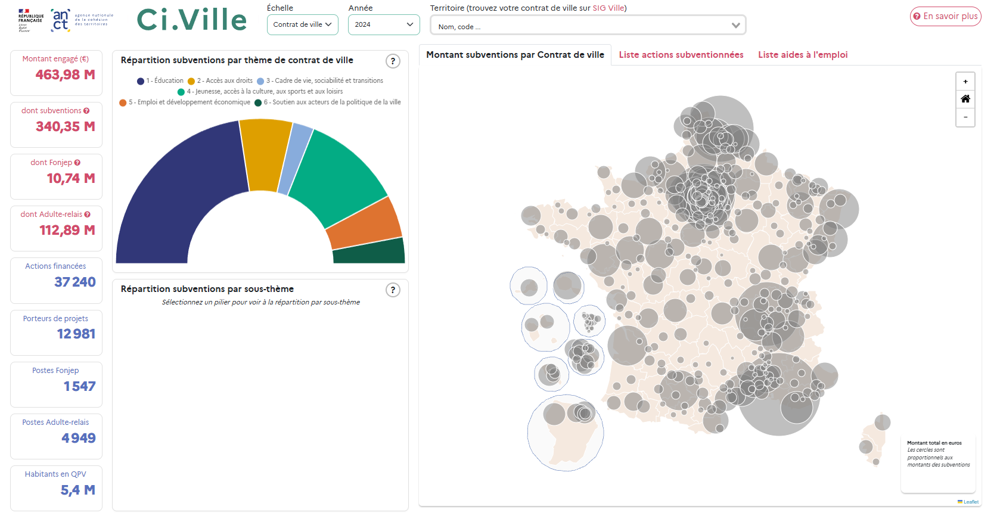

# Ci.Ville
(Cartes interactives de la politique de la ville)



Présentation interactive par thème et par territoire des crédits de la politique de la ville, alloués par l'État sous forme de subventions pour des porteurs d'actions ou de contrats aidés Fonjep et Adulte-relais depuis 2024.
Une autre application existe pour la présentation des données de 2020 à 2023. 

[Page officielle](https://acteurs.lagrandeequipe.fr/article/74845)

[Lien direct](https://cartes.anct.gouv.fr/vie-associative-2/#/panorama/contrat-de-ville)

## Données

Les données source sont issues de la plateforme collaborative de la politique de la ville Dauphin. Elles sont diffusées sous Licence ouverte 2.0 sur [data.gouv.fr](https://www.data.gouv.fr/fr/datasets/subventions-politique-de-la-ville/).

## Technologies

Cet outil, conçu et développé par le service cartographie de l'ANCT, a été réalisé à l'aide du framework Vue.js 3.x et de ses extensions VueX et Vue-router. Il utilise les librairies Leaflet.js, Chart.js, Bootstrap, Gsap

## En savoir plus sur les subventions politique de la ville : 

Sur le site ANCT : [https://agence-cohesion-territoires.gouv.fr/subventions-de-la-politique-de-la-ville-101](https://agence-cohesion-territoires.gouv.fr/subventions-de-la-politique-de-la-ville-101)


## Installation des dépendances
```
npm install
```

### Compilation et hot-reloads pour le développement
```
npm run serve
```

### Compilation et minimification pour la mise en production
```
npm run build
```

### Lints et réparation de fichiers
```
npm run lint
```

### Personalisation de la configuration
See [Configuration Reference](https://cli.vuejs.org/config/).
